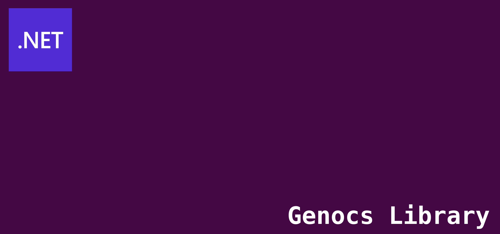

<!-- PROJECT SHIELDS -->

[![License][license-shield]][license-url]
[![Build][build-shield]][build-url]
[![Packages][package-shield]][package-url]
[![Downloads][downloads-shield]][downloads-url]
[![Contributors][contributors-shield]][contributors-url]
[![Forks][forks-shield]][forks-url]
[![Stargazers][stars-shield]][stars-url]
[![Issues][issues-shield]][issues-url]
[![Discord][discord-shield]][discord-url]
[![Gitter][gitter-shield]][gitter-url]
[![Twitter][twitter-shield]][twitter-url]
[![Twitterx][twitterx-shield]][twitterx-url]
[![LinkedIn][linkedin-shield]][linkedin-url]

[license-shield]: https://img.shields.io/github/license/Genocs/genocs-library-template?color=2da44e&style=flat-square
[license-url]: https://github.com/Genocs/genocs-library-template/blob/main/LICENSE
[build-shield]: https://github.com/Genocs/genocs-library-template/actions/workflows/build_and_test.yml/badge.svg?branch=main
[build-url]: https://github.com/Genocs/genocs-library-template/actions/workflows/build_and_test.yml
[package-shield]: https://img.shields.io/badge/nuget-v.2.3.0-blue?&label=latests&logo=nuget
[package-url]: https://github.com/Genocs/genocs-library-template/actions/workflows/build_and_test.yml
[downloads-shield]: https://img.shields.io/nuget/dt/Genocs.Library.Template.svg?color=2da44e&label=downloads&logo=nuget
[downloads-url]: https://www.nuget.org/packages/Genocs.Library.Template
[contributors-shield]: https://img.shields.io/github/contributors/Genocs/genocs-library-template.svg?style=flat-square
[contributors-url]: https://github.com/Genocs/genocs-library-template/graphs/contributors
[forks-shield]: https://img.shields.io/github/forks/Genocs/genocs-library-template?style=flat-square
[forks-url]: https://github.com/Genocs/genocs-library-template/network/members
[stars-shield]: https://img.shields.io/github/stars/Genocs/genocs-library-template.svg?style=flat-square
[stars-url]: https://img.shields.io/github/stars/Genocs/genocs-library-template?style=flat-square
[issues-shield]: https://img.shields.io/github/issues/Genocs/genocs-library-template?style=flat-square
[issues-url]: https://github.com/Genocs/genocs-library-template/issues
[discord-shield]: https://img.shields.io/discord/1106846706512953385?color=%237289da&label=Discord&logo=discord&logoColor=%237289da&style=flat-square
[discord-url]: https://discord.com/invite/fWwArnkV
[gitter-shield]: https://img.shields.io/badge/chat-on%20gitter-blue.svg
[gitter-url]: https://gitter.im/genocs/
[twitter-shield]: https://img.shields.io/twitter/follow/genocs?color=1DA1F2&label=Twitter&logo=Twitter&style=flat-square
[twitter-url]: https://twitter.com/genocs
[linkedin-shield]: https://img.shields.io/badge/-LinkedIn-black.svg?style=flat-square&logo=linkedin&colorB=555
[linkedin-url]: https://www.linkedin.com/in/giovanni-emanuele-nocco-b31a5169/
[twitterx-shield]: https://img.shields.io/twitter/url/https/twitter.com/genocs.svg?style=social
[twitterx-url]: https://twitter.com/genocs

<p align="center">
    
</p>

# Genocs Library Template

A comprehensive .NET project template that incorporates essential packages and follows Clean Architecture principles. This template provides a solid foundation for building scalable web applications and services.

## Overview

This repository provides a comprehensive .NET project template designed to accelerate web application development. It includes:

- **Clean Architecture**: Well-structured, maintainable codebase following industry best practices
- **Essential Packages**: Pre-configured with the most commonly needed NuGet packages
- **Ready-to-Use Components**: Built-in features and components to jumpstart development
- **Multiple Project Types**: Support for Web APIs, Worker services, and more

> **Note**: This template focuses on backend services. For frontend applications, check out our separate frontend templates.

## What's Included

- Web API project with controllers and infrastructure
- Worker service for background processing
- Domain-driven design structure
- Unit and integration test projects
- Docker support
- Kubernetes deployment manifests
- Azure DevOps pipeline configurations

## Prerequisites

Before getting started, ensure you have the following installed:

- [.NET 9.x](https://dotnet.microsoft.com/download/dotnet/9.0)
- [Git](https://git-scm.com/downloads)

### Optional Development Tools
- [Visual Studio 2022](https://visualstudio.microsoft.com/vs/preview/vs2022/)
- [Visual Studio Code](https://code.visualstudio.com/download)
- [JetBrains Rider](https://www.jetbrains.com/rider/)

## Quick Start

### Option 1: Install from NuGet (Recommended)

```bash
# Install the latest template
dotnet new install Genocs.Library.Template

# Install a specific version
dotnet new install Genocs.Library.Template::2.3.0

# Create a new project
dotnet new gnx-librawebapi --name MyCompany.MyProject
```

### Option 2: Build and Install from Source

```bash
# Clone the repository
git clone https://github.com/Genocs/genocs-library-template

# Navigate to the source directory
cd genocs-library-template

# Build the NuGet package
nuget pack ./src/Package.Template.nuspec -NoDefaultExcludes -OutputDirectory ./out -Version 2.3.0

# Install the template locally
dotnet new install ./out/Genocs.Library.Template.2.3.0.nupkg

# Create a new project
dotnet new gnx-librawebapi --name MyCompany.MyProject
```

### Get Help

To see all available options for the template:

```bash
dotnet new gnx-librawebapi --help
```

> **Latest Version**: The current stable version is **2.3.0**. Check [NuGet](https://www.nuget.org/packages/Genocs.Library.Template/) for the latest release.

## Usage

### Creating a New Project

```bash
Once the template is installed, create a new project using:

```bash
# Create a new project with your desired name
dotnet new gnx-librawebapi --name CompanyName.ProjectName.ServiceName

# Navigate to the project directory
cd CompanyName.ProjectName.ServiceName

# Build the solution
dotnet build

# Run tests
dotnet test

# Run the Web API
dotnet run --project ./src/CompanyName.ProjectName.ServiceName.WebApi

# Run the Worker service (in a separate terminal)
dotnet run --project ./src/CompanyName.ProjectName.ServiceName.Worker
```

### Development Workflow

```bash
# Build specific projects
dotnet build ./src/CompanyName.ProjectName.ServiceName.WebApi
dotnet build ./src/CompanyName.ProjectName.ServiceName.Worker

# Run tests with detailed output
dotnet test --verbosity normal

# Watch for changes during development
dotnet watch run --project ./src/CompanyName.ProjectName.ServiceName.WebApi
```

### Useful Commands

```bash
# List all installed templates
dotnet new list

# Uninstall the template
dotnet new uninstall Genocs.Library.Template

# Get help for the template
dotnet new gnx-librawebapi --help
```

## Documentation

For comprehensive documentation and advanced usage:

- [Genocs Library Documentation](https://genocs-blog.netlify.app/library/)
- [.NET Custom Templates Guide](https://docs.microsoft.com/en-us/dotnet/core/tools/custom-templates)
- [Visual Studio Project Templates](https://learn.microsoft.com/en-us/visualstudio/ide/how-to-locate-and-organize-project-and-item-templates?view=vs-2022)

## Contributing

We welcome contributions! Please see our [Contributing Guidelines](CONTRIBUTING.md) for details on how to submit pull requests, report issues, and contribute to the project.

## License

This project is licensed under the [MIT License](LICENSE).

## Changelog

View the complete [changelog](https://github.com/Genocs/genocs-library-template/blob/main/CHANGELOG.md) for detailed release notes and version history.

## Community

Join our community and stay connected:

- 💬 **Discord**: [@genocs](https://discord.com/invite/fWwArnkV)
- 📘 **Facebook**: [@genocs](https://facebook.com/Genocs)
- 📺 **YouTube**: [@genocs](https://youtube.com/c/genocs)

## Support This Project

If this project has helped you learn something new or assisted you in your work, consider supporting it:

- ⭐ **Star this repository** to show your appreciation
- 🔄 **Share** this project with your colleagues and networks
- 💼 **Endorse** on LinkedIn for ASP.NET Core - [Connect with the maintainer](https://www.linkedin.com/in/giovanni-emanuele-nocco-b31a5169/)
- ☕ **Buy me a coffee** to support long-term development - [Support via Buy Me a Coffee](https://www.buymeacoffee.com/genocs)

<p align="center">
  <a href="https://www.buymeacoffee.com/genocs">
    
  </a>
</p>

## Contributors

This project exists thanks to all the people who contribute. We welcome new contributors!

### Code Contributors

<p align="center">
  <a href="https://github.com/Genocs/genocs-library-template/graphs/contributors">
    
  </a>
</p>

**Want to contribute?** Check out our [Contributing Guidelines](CONTRIBUTING.md) to get started.

### Financial Contributors

Become a financial contributor and help sustain this project's development.

**Support the project on [Open Collective](https://opencollective.com/genocs)**

<p align="center">
  <a href="https://opencollective.com/genocs">
    
  </a>
</p>

---

<p align="center">
  Made with ❤️ by the <a href="https://github.com/Genocs">Genocs</a> team
</p>
